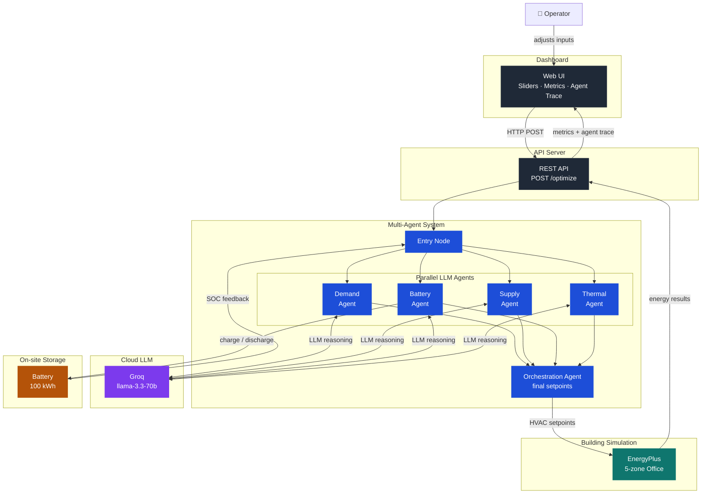

# BuilMirai Agentic BMS — Architecture

```mermaid
flowchart TD
    USER["👤 Operator"]

    subgraph UI["Dashboard"]
        DASH["Web UI\nSliders · Metrics · Agent Trace"]
    end

    subgraph BACKEND["API Server"]
        API["REST API\nPOST /optimize"]
    end

    subgraph AGENTS["Multi-Agent System"]
        direction TB
        ENTRY["Entry Node"]

        subgraph PARALLEL["Parallel LLM Agents"]
            direction LR
            D["Demand\nAgent"]
            S["Supply\nAgent"]
            B["Battery\nAgent"]
            T["Thermal\nAgent"]
        end

        ORC["Orchestration Agent\nfinal setpoints"]
    end

    subgraph CLOUD["Cloud LLM"]
        LLM["Groq\nllama-3.3-70b"]
    end

    subgraph SIMULATION["Building Simulation"]
        EPS["EnergyPlus\n5-zone Office"]
    end

    subgraph STORAGE["On-site Storage"]
        BAT["Battery\n100 kWh"]
    end

    USER -->|"adjusts inputs"| DASH
    DASH -->|"HTTP POST"| API
    API --> ENTRY
    ENTRY --> D & S & B & T
    D & S & B & T <-->|"LLM reasoning"| LLM
    D & S & B & T --> ORC
    ORC -->|"HVAC setpoints"| EPS
    B -->|"charge / discharge"| BAT
    BAT -->|"SOC feedback"| ENTRY
    EPS -->|"energy results"| API
    API -->|"metrics + agent trace"| DASH

    classDef agent fill:#1D4ED8,color:#fff,stroke:none
    classDef cloud fill:#7C3AED,color:#fff,stroke:none
    classDef sim   fill:#0F766E,color:#fff,stroke:none
    classDef bat   fill:#B45309,color:#fff,stroke:none
    classDef ui    fill:#1F2937,color:#fff,stroke:none
    classDef api   fill:#1F2937,color:#fff,stroke:none

    class D,S,B,T,ORC,ENTRY agent
    class LLM cloud
    class EPS sim
    class BAT bat
    class DASH ui
    class API api
```
